# NovelPilot

A Gemma 4-powered AI writing agent that turns one prompt into a complete story creation pipeline.

NovelPilot is designed to demonstrate Gemma 4 as a multi-agent creative reasoning engine, not just a text completion model.

## Live Demo

- Live app: https://novelpilot.vercel.app
- Source code: https://github.com/dorakingx/novelpilot

Judges can open the live app and click **Run Judge Demo** to experience the full NovelPilot pipeline without an API key.

<!-- Screenshot: add `docs/screenshot.png` after deploying to Vercel -->

### Judge Demo (60 seconds)

1. Open the live app (Vercel URL above).
2. Click **Run Judge Demo** (left panel or center **Try the Judge Demo**).
3. Watch nine agents complete: Premise Architect through Publisher Agent.
4. Review **Foreshadowing Tracker** and **Continuity Detective** on the right.
5. Click **Export Full Demo Markdown** for a DEV/Hackathon submission bundle.

No API key required for Judge Demo — curated sample outputs demonstrate the full pipeline.

## Why Gemma 4?

NovelPilot uses Gemma 4 as the reasoning engine behind a multi-agent story pipeline. The model powers:

- **Structured generation** — each agent returns typed JSON (concept, cast, plot, foreshadowing tracker, continuity issues).
- **Long-context story memory** — later agents receive the full story bible and prior agent outputs.
- **Continuity and foreshadowing reasoning** — the Continuity Detective returns severity-ranked issues with evidence and fixes; the Foreshadowing Tracker maps planned payoffs.

## Agent pipeline

```mermaid
flowchart LR
  prompt[User Prompt] --> premise[Premise Architect]
  premise --> cast[Character Director]
  cast --> world[World Builder]
  world --> plot[Plot Strategist]
  plot --> chapters[Chapter Architect]
  chapters --> prose[Prose Writer]
  prose --> editor[Style Editor]
  editor --> detective[Continuity Detective]
  detective --> publish[Publisher Agent]
```



| Agent | Role |
|-------|------|
| Premise Architect | Logline, theme, conflict, hook |
| Character Director | Protagonist, antagonist, supporting cast |
| World Builder | Setting, rules, atmosphere, symbols |
| Plot Strategist | Structure, twists, foreshadowing seeds |
| Chapter Architect | Chapter outline + **Foreshadowing Tracker** |
| Prose Writer | Chapter 1 literary draft |
| Style Editor | Pacing, dialogue, revision notes |
| Continuity Detective | Structured issues + unresolved threads |
| Publisher Agent | Titles, summaries, submission copy |

## Features

- One-click **Judge Demo** for hackathon judges
- Nine-agent sequential writing room with timeline UI
- **Foreshadowing Tracker** with planned / unresolved / paid-off status
- **Continuity Detective** with severity, category, evidence, and suggested fixes
- Human-in-the-loop: Approve, Regenerate, Edit Output per agent
- Export: Full Demo Markdown, DEV summary, bible, manuscript, JSON
- English and Japanese output
- Mock mode (no API key) and live Gemma 4 mode

## Setup

```bash
npm install
npm run dev
```

Open [http://localhost:3000](http://localhost:3000).

### Environment variables

Copy `.env.example` to `.env.local`:

```env
GEMMA_API_KEY=your_key_here
GEMMA_API_URL=https://generativelanguage.googleapis.com/v1beta/models
GEMMA_MODEL=gemma-4-31b-it
NEXT_PUBLIC_APP_NAME=NovelPilot
```

### Mock mode

If `GEMMA_API_KEY` is empty, the app uses curated sample outputs. The banner shows **Demo mode**. All UI features work without configuration.

### Live mode

Set `GEMMA_API_KEY` and restart the dev server. Each agent calls Gemma 4 via [`lib/gemma.ts`](lib/gemma.ts) (provider-swappable).

## Deploying to Vercel

1. Import this GitHub repository into Vercel.
2. Use the default Next.js settings.
3. Leave `GEMMA_API_KEY` empty if you want demo/mock mode.
4. Optional live mode environment variables:
   - `GEMMA_API_KEY`
   - `GEMMA_API_URL`
   - `GEMMA_MODEL`
5. Deploy.
6. Open the deployed URL and click **Run Judge Demo**.

**Important:** The app must work on Vercel without `GEMMA_API_KEY` because Judge Demo uses curated mock outputs.

## Architecture

```
app/page.tsx              → 3-column UI, Judge Demo CTA
lib/useStoryProject.ts    → client orchestration, AbortController stop
app/api/generate-agent/   → one agent per request
lib/run-agent.ts          → prompt + Gemma + JSON parse
lib/agents.ts             → merge outputs into StoryBible / reports
lib/mock-outputs.ts       → EN/JA demo data
```

State is **in-memory** (React) — no database or auth.

## Scripts

- `npm run dev` — development server
- `npm run build` — production build
- `npm run lint` — ESLint
- `npm run start` — production server

## Hackathon submission

- **Live demo:** https://novelpilot.vercel.app (primary judge experience — no video required)
- **DEV post draft:** [`docs/dev-post-draft.md`](docs/dev-post-draft.md)
- **Checklist:** [`docs/submission-checklist.md`](docs/submission-checklist.md)

## DEV article

See [`docs/dev-post-draft.md`](docs/dev-post-draft.md) for a polished hackathon / DEV.to post draft.

## Future improvements

- Multi-chapter draft generation
- Streaming agent output (SSE)
- Persist projects (localStorage or cloud)
- Fine-tuned Gemma prompts per genre

## License

MIT
