# NovelPilot

A Gemma 4-powered AI writing agent that turns one prompt into a complete story creation pipeline.

NovelPilot is designed to demonstrate Gemma 4 as a multi-agent creative reasoning engine, not just a text completion model.

## Live Demo

- Live app: https://novelpilot.vercel.app
- Source code: https://github.com/dorakingx/novelpilot

Judges can open the live app and click **Run Judge Demo** to experience the full NovelPilot pipeline without an API key.

## Fast Judge Path

1. Open https://novelpilot.vercel.app
2. Click **Run Judge Demo**
3. Wait for the nine-agent pipeline to complete
4. NovelPilot automatically opens the **Completed Novel** reader
5. Click **Download PDF** (browser Save as PDF) to save the full story
6. Optional: click **Back to Agent Workspace** to inspect Story Bible, Foreshadowing Tracker, and Continuity Detective
7. Click **Read Finished Novel** anytime to reopen the completed reader
8. Click **Export Full Demo Markdown** for submission bundle

After the agents complete, NovelPilot opens the finished multi-chapter story reader. Users can return to the agent workspace to review the pipeline, then reopen the reader at any time using **Read Finished Novel**.

The default judging experience does not require an API key; Live OpenRouter mode is optional.

<!-- Screenshot: add `docs/screenshot.png` after deploying to Vercel -->

### Judge Demo (60 seconds)

1. Open the live app (Vercel URL above).
2. Click **Run Judge Demo** on the prompt launcher screen.
3. Watch nine agents complete: Premise Architect through Publisher Agent.
4. NovelPilot automatically opens the finished **Completed Novel** reader with all chapters.
5. Click **Download PDF** to save the full multi-chapter story via your browser’s Save as PDF option.
6. Click **Back to Agent Workspace** to review Foreshadowing Tracker and Continuity Detective.
7. Click **Read Finished Novel** to reopen the completed reader at any time.
8. Click **Export Full Demo Markdown** for a DEV/Hackathon submission bundle.

No API key required for Judge Demo — curated sample outputs demonstrate the full pipeline.

## Why Gemma 4?

NovelPilot uses Gemma 4 as the reasoning engine behind a multi-agent story pipeline. The model powers:

- **Structured generation** — each agent returns typed JSON (concept, cast, plot, foreshadowing tracker, continuity issues).
- **Long-context story memory** — later agents receive the full story bible and prior agent outputs.
- **Continuity and foreshadowing reasoning** — the Continuity Detective returns severity-ranked issues with evidence and fixes; the Foreshadowing Tracker maps planned payoffs.

## Agent pipeline

```mermaid
flowchart LR
  prompt[User Prompt] --> premise[Premise Architect]
  premise --> cast[Character Director]
  cast --> world[World Builder]
  world --> plot[Plot Strategist]
  plot --> chapters[Chapter Architect]
  chapters --> prose[Prose Writer]
  prose --> editor[Style Editor]
  editor --> detective[Continuity Detective]
  detective --> publish[Publisher Agent]
```



| Agent | Role |
|-------|------|
| Premise Architect | Logline, theme, conflict, hook |
| Character Director | Protagonist, antagonist, supporting cast |
| World Builder | Setting, rules, atmosphere, symbols |
| Plot Strategist | Structure, twists, foreshadowing seeds |
| Chapter Architect | Chapter outline + **Foreshadowing Tracker** |
| Prose Writer | Complete multi-chapter literary draft (batch or per-chapter) |
| Style Editor | Pacing, dialogue, revision notes |
| Continuity Detective | Structured issues + unresolved threads |
| Publisher Agent | Titles, summaries, submission copy |

## User experience

NovelPilot uses a two-stage flow:

1. **Prompt Launcher** — the user enters a story idea and settings on a focused full-screen start view.
2. **Agent Workspace** — nine Gemma-powered agents run the full writing pipeline and produce the story bible, draft, foreshadowing tracker, continuity report, and publisher package.

## Simple story structure controls

NovelPilot no longer uses a single global target length as the main control. On the **Prompt Launcher**, **Story Structure** keeps setup simple:

- **Structure presets** — Short Story, Novella, Serialized Novel Plan, or Custom (parts × chapters per part)
- **Approximate chapter length** — Very short through Very long (or Custom uniform length), applied uniformly to all chapters by default
- **Chapter slots** — read-only preview (`Chapter 1 — title will be generated`) with approximate length per row
- **Total planned length** — read-only summary (e.g. `3 chapters × about 4,000 characters = about 12,000 characters total`)
- **Customize each chapter length** — optional advanced toggle for per-chapter numeric lengths
- **Chapter titles** — generated by the Chapter Architect from your prompt (include desired titles in the prompt if you want specific names)
- **Structure review** before drafting (Structure Designer after Chapter Architect; **Edit structure details** for advanced edits)
- **Chapter-by-chapter generation** for works with more than 3 chapters

Per-chapter lengths are **approximate pacing guidance** for the Prose Writer (±20% acceptable), not hard cutoffs.

Long-form works are generated one chapter at a time, not in a single API call.

## Automatic recovery

NovelPilot automatically retries failed agent calls (up to 2 attempts for most agents). If **Chapter Architect** cannot return valid structure JSON, NovelPilot can apply a **fallback structure** from your launcher settings and continue when possible.

Recovery actions in the workspace:

- **Retry and Continue** — re-run the failed agent and resume later agents
- **Use Fallback Structure** — apply a minimal editable outline and continue (or pause for structure approval)
- **Continue Pipeline** — resume from the first incomplete agent when the run stopped unexpectedly

When structure approval is enabled, the pipeline **intentionally pauses** after Chapter Architect with the message “Structure is ready. Review and approve to continue.” **Judge Demo** skips this pause and runs through automatically.

## Features

- One-click **Judge Demo** for hackathon judges
- Nine-agent sequential writing room with timeline UI
- **Foreshadowing Tracker** with planned / unresolved / paid-off status
- **Continuity Detective** with severity, category, evidence, and suggested fixes
- Human-in-the-loop: Approve, Regenerate, Edit Output per agent
- **Complete multi-chapter manuscript generation** with customizable structure
- Export: Full Demo Markdown, DEV summary, bible, manuscript, JSON
- **Completed Novel Reader** — read the full generated story in a polished, distraction-free full-screen view with chapter navigation
- **Automatic transition** to the completed novel reader when all agents finish
- **Polished PDF export** of the full story via browser Save as PDF / print flow (Japanese-friendly)
- English and Japanese output
- Mock mode (no API key) and live Gemma 4 mode

## Setup

```bash
npm install
npm run dev
```

Open [http://localhost:3000](http://localhost:3000).

### Environment variables

Copy `.env.example` to `.env.local`:

```env
GEMMA_PROVIDER=openrouter
GEMMA_API_KEY=
GEMMA_API_URL=https://openrouter.ai/api/v1/chat/completions
GEMMA_MODEL=google/gemma-4-31b-it
OPENROUTER_APP_NAME=NovelPilot
NEXT_PUBLIC_APP_NAME=NovelPilot
```

The Gemma 4 Challenge requires a Gemma 4 model. If the default OpenRouter model name changes, choose a currently available Gemma 4 model from [OpenRouter's model list](https://openrouter.ai/models) and set `GEMMA_MODEL` accordingly.

### Mock mode

If `GEMMA_API_KEY` is empty, the app uses curated sample outputs. The banner shows **Demo mode**. Judge Demo and all UI features work without any API key.

### Live mode (OpenRouter — recommended)

NovelPilot calls Gemma 4 through [OpenRouter](https://openrouter.ai) chat completions by default. Set `GEMMA_API_KEY` to your OpenRouter API key and restart the dev server. The banner shows **Live mode** with provider and model name.

Recommended:

```env
GEMMA_PROVIDER=openrouter
GEMMA_API_URL=https://openrouter.ai/api/v1/chat/completions
GEMMA_MODEL=google/gemma-4-31b-it
```

See [Using OpenRouter](#using-openrouter) below.

### Live mode (Google generateContent — optional)

Set `GEMMA_PROVIDER=google` and point `GEMMA_API_URL` / `GEMMA_MODEL` at Google's `generateContent` endpoint. See commented example in `.env.example`.

## Using OpenRouter

1. Create an [OpenRouter](https://openrouter.ai) API key.
2. In Vercel (or `.env.local` for local dev), add:
   - `GEMMA_PROVIDER=openrouter`
   - `GEMMA_API_KEY=` your OpenRouter key
   - `GEMMA_API_URL=https://openrouter.ai/api/v1/chat/completions`
   - `GEMMA_MODEL=google/gemma-4-31b-it`
   - `OPENROUTER_APP_NAME=NovelPilot`
3. Redeploy (Vercel) or restart `npm run dev`.
4. Open the app and confirm the banner shows **Live mode: using openrouter / …**

The Gemma 4 Challenge requires a Gemma 4 model. If the default OpenRouter model name changes, choose a currently available Gemma 4 model from [OpenRouter's model list](https://openrouter.ai/models) and set `GEMMA_MODEL` accordingly.

## OpenRouter prompt tokens limit exceeded

If you see:

> Prompt tokens limit exceeded

OpenRouter rejected the request because the **input prompt/context** is too large for your current credit or model allowance. This is not the same as `max_tokens` (output length).

**Fixes:**

- Shorten your user prompt
- Reduce number of parts/chapters in Story Structure
- Add OpenRouter credits or use an account/model with a larger context allowance

NovelPilot compacts each agent’s context in live mode (summaries and excerpts instead of the full project JSON).

## OpenRouter 402 error (max_tokens)

If you see:

> This request requires more credits, or fewer max_tokens

OpenRouter rejected the request because your account cannot afford the requested **output** max token budget for that call.

**Fixes:**

- Add OpenRouter credits
- Lower approximate chapter length or chapter count in Story Structure
- Set `GEMMA_MAX_TOKENS_CAP=1200` or `800` in `.env.local` / Vercel (caps all agents)
- Use a cheaper model via `GEMMA_MODEL`

NovelPilot uses smaller per-agent `max_tokens` by default (e.g. Premise Architect ~900, Prose Writer ~2200) instead of a flat 8192 for every agent.

## Deploying to Vercel

1. Import this GitHub repository into Vercel.
2. Use the default Next.js settings.
3. Leave `GEMMA_API_KEY` empty if you want demo/mock mode.
4. Optional live mode (OpenRouter) environment variables:
   - `GEMMA_PROVIDER=openrouter`
   - `GEMMA_API_KEY`
   - `GEMMA_API_URL=https://openrouter.ai/api/v1/chat/completions`
   - `GEMMA_MODEL=google/gemma-4-31b-it`
   - `OPENROUTER_APP_NAME=NovelPilot`
   - `GEMMA_MAX_TOKENS_CAP` (optional, e.g. `6000` for low-credit accounts)
5. Deploy.
6. Open the deployed URL and click **Run Judge Demo**.

**Important:** The app must work on Vercel without `GEMMA_API_KEY` because Judge Demo uses curated mock outputs.

Live generation uses a 60-second per-agent timeout on [`app/api/generate-agent/route.ts`](app/api/generate-agent/route.ts) (`maxDuration = 60`). If Chapter Architect fails on large structures, use **Use Fallback Structure** in the workspace or reduce chapter count.

## Architecture

```
app/page.tsx              → 3-column UI, Judge Demo CTA
lib/useStoryProject.ts    → client orchestration, AbortController stop
app/api/generate-agent/   → one agent per request
lib/run-agent.ts          → prompt + OpenRouter/Gemma + JSON parse
lib/gemma.ts              → OpenRouter, Google, or custom provider
lib/agents.ts             → merge outputs into StoryBible / reports
lib/mock-outputs.ts       → EN/JA demo data
```

State is **in-memory** (React) — no database or auth.

## Scripts

- `npm run dev` — development server
- `npm run build` — production build
- `npm run lint` — ESLint
- `npm run start` — production server

## Hackathon submission

- **Live demo:** https://novelpilot.vercel.app (primary judge experience — no video required)
- **DEV post draft:** [`docs/dev-post-draft.md`](docs/dev-post-draft.md)
- **Checklist:** [`docs/submission-checklist.md`](docs/submission-checklist.md)

## DEV article

See [`docs/dev-post-draft.md`](docs/dev-post-draft.md) for a polished hackathon / DEV.to post draft.

## Future improvements

- Multi-chapter draft generation
- Streaming agent output (SSE)
- Persist projects (localStorage or cloud)
- Fine-tuned Gemma prompts per genre

## License

MIT
